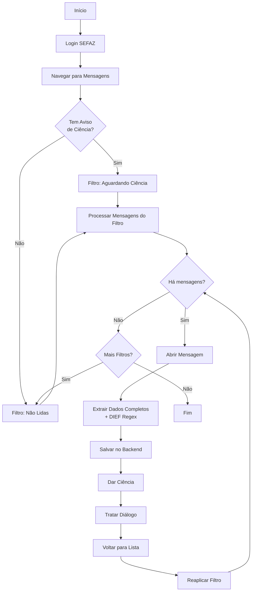

# MessageBot Extension - Implementação Completa

## ✅ Implementação Concluída

### Data: 20/11/2025

## Funcionalidades Implementadas

### 1. Sistema de Filtros Multi-Nível ✅
- **Verificação de Aviso de Ciência**: Detecta mensagens prioritárias automaticamente
- **Filtro "Aguardando Ciência"** (valor 4): Processado primeiro quando há aviso
- **Filtro "Não Lidas"** (valor 3): Processado sempre após ciência
- **Aplicação Dinâmica**: Filtros reaplicados antes de cada mensagem (retry logic)

### 2. Extração Completa de Dados DIEF ✅
Implementados todos os campos via regex:

```javascript
// Competência DIEF
/Período da DIEF:\s*(\d{6})/i
/Competência:\s*(\d{2})\/(\d{4})/i

// Status DIEF
/DIEF\s+(PROCESSADA|NÃO\s+PROCESSADA|NAO\s+PROCESSADA|REJEITADA)/i

// Chave de Segurança
/Chave de segurança:\s*([\d-]+)/i

// Protocolo
/Protocolo:\s*(\d+)/i

// Link do Recibo
document.querySelector('a[href*="listIReciboDief.do"]')
```

### 3. Campos Extraídos ✅
- `inscricao_estadual`
- `cpf_socio` ✅ (agora propagado corretamente)
- `nome_empresa` ✅
- `enviada_por`
- `data_envio`
- `assunto`
- `classificacao`
- `tributo`
- `tipo_mensagem`
- `numero_documento`
- `vencimento`
- `data_leitura`
- `conteudo_html`
- `conteudo_mensagem`
- `competencia_dief` ✅
- `status_dief` ✅
- `chave_dief` ✅
- `protocolo_dief` ✅
- `link_recibo` ✅

### 4. Seletores Prioritários ✅
```javascript
const conteudoSelectors = [
    'td[width="100%"]',                      // Prioridade 1
    'table.table-tripped tbody tr td:last-child', // Prioridade 2
    '.mensagem-conteudo',                    // Prioridade 3
    '#mensagem-corpo'                        // Prioridade 4
];
```

Com validação de tamanho mínimo: **50 caracteres**

### 5. Lógica de Retry ✅
- Reaplicação de filtro antes de cada mensagem
- Contagem de mensagens disponíveis
- Máximo de 3 tentativas consecutivas sem mensagens
- Tratamento de erros com fallback

### 6. Tratamento de Diálogos ✅
```javascript
async function tratarDialogoConfirmacao() {
    // Procura e clica em: OK, Confirmar, Fechar
    // Aguarda 1000ms
}
```

### 7. Integração Frontend ✅
**frontend/js/modules/empresas.js**:
```javascript
sefazWindow.postMessage({
    type: 'SEFAZ_PROCESSAR_MENSAGENS',
    cpf: cpf,
    cpfSocio: cpf,  // ✅ Adicionado
    senha: senha,
    inscricao_estadual: inscricaoEstadual,
    inscricaoEstadual: inscricaoEstadual
}, 'https://sefaznet.sefaz.ma.gov.br');
```

### 8. Fluxo Completo ✅



## Arquivos Modificados

### 1. extensao-messagebot/content.js
- **Linhas**: ~700 (era 422)
- **Novas Funções**:
  - `verificarAvisoCiencia()` - Detecta aviso vermelho
  - `processarTodasMensagensDisponiveis()` - Orquestrador multi-filtro
  - `aplicarFiltroMensagens()` - Aplica filtro select
  - `contarMensagensNaTabela()` - Conta links disponíveis
  - `processarMensagensFiltro()` - Loop com retry
  - `processarMensagemAtual()` - Processa mensagem aberta
  - `extrairDadosMensagemCompleta()` - Extração com regex DIEF
  - `extrairDadosDIEF()` - Regex patterns para DIEF
  - `tratarDialogoConfirmacao()` - Confirma diálogos
  - `salvarMensagemNoBackend()` - POST para API
  - `realizarLogin()` - Login automático

### 2. frontend/js/modules/empresas.js
- Adicionado `cpfSocio` ao postMessage

### 3. extensao-messagebot/background.js
- Já estava correto, passa todos os dados

## Paridade com Python Bot

### ✅ Funcionalidades Equivalentes

| Funcionalidade | Python Bot | Chrome Extension |
|----------------|-----------|------------------|
| Login Automático | ✅ | ✅ |
| Navegação para Mensagens | ✅ | ✅ |
| Verificação de Aviso | ✅ | ✅ |
| Filtro "Aguardando Ciência" | ✅ | ✅ |
| Filtro "Não Lidas" | ✅ | ✅ |
| Reaplicação de Filtros | ✅ | ✅ |
| Extração de Dados Básicos | ✅ | ✅ |
| Extração de DIEF (regex) | ✅ | ✅ |
| CPF do Sócio | ✅ | ✅ |
| Nome da Empresa | ✅ | ✅ |
| Seletores Prioritários | ✅ | ✅ |
| Validação 50 chars | ✅ | ✅ |
| Salvar no Backend | ✅ | ✅ |
| Dar Ciência | ✅ | ✅ |
| Tratar Diálogos | ✅ | ✅ |
| Retry Logic | ✅ | ✅ |
| Max 3 Tentativas | ✅ | ✅ |

## Próximos Passos

### 1. Instalação da Extensão
```bash
chrome://extensions/
→ Ativar "Modo do desenvolvedor"
→ "Carregar sem compactação"
→ Selecionar pasta: d:\CODIGOS\copilot\consulta-ie\extensao-messagebot\
```

### 2. Teste End-to-End
1. Abrir frontend (localhost:5500)
2. Ir para aba "Empresas"
3. Clicar no ícone 📧 (mail-check) de uma empresa
4. Verificar:
   - ✅ Nova aba SEFAZ abre
   - ✅ Login automático
   - ✅ Navegação para mensagens
   - ✅ Aplicação de filtros
   - ✅ Processamento de mensagens
   - ✅ Extração de dados DIEF
   - ✅ Salvamento no backend
   - ✅ Ciência dada
   - ✅ Retorno para lista

### 3. Validação de Dados
```bash
# Verificar mensagens salvas
curl http://localhost:8000/api/mensagens?inscricao_estadual=<IE>

# Verificar campos DIEF
SELECT 
    inscricao_estadual,
    cpf_socio,
    nome_empresa,
    assunto,
    competencia_dief,
    status_dief,
    chave_dief,
    protocolo_dief,
    link_recibo
FROM mensagens
WHERE inscricao_estadual = '<IE>'
ORDER BY data_envio DESC;
```

## Logs para Debug

### Console do Content Script
```javascript
[MessageBot] Iniciando fluxo
[MessageBot] Verificando aviso de ciencia...
[MessageBot] Tem aviso de ciencia: true
[MessageBot] Processando filtro: Aguardando Ciência
[MessageBot] Aplicando filtro: 4
[MessageBot] Mensagens disponiveis no filtro: 5
[MessageBot] Abrindo mensagem...
[MessageBot] Mensagem processada com sucesso
[MessageBot] Filtro Aguardando Ciência: 5 mensagens processadas
[MessageBot] Processando filtro: Não Lidas
[MessageBot] Total processadas: 12
```

## Comparação de Código

### Python Bot
```python
def _processar_todas_mensagens_disponiveis(self, cpf_socio: str, inscricao_estadual: str):
    tem_aviso_ciencia = self._verificar_aviso_ciencia()
    filtros = []
    if tem_aviso_ciencia:
        filtros.append(('Aguardando Ciência', '4'))
    filtros.append(('Não Lidas', '3'))
    
    for nome, valor in filtros:
        self._processar_mensagens_do_filtro(cpf_socio, inscricao_estadual, nome, valor)
```

### Chrome Extension
```javascript
async function processarTodasMensagensDisponiveis(cpfSocio, inscricaoEstadual, temAvisoCiencia) {
    const filtros = [];
    if (temAvisoCiencia) {
        filtros.push({ nome: 'Aguardando Ciência', valor: '4' });
    }
    filtros.push({ nome: 'Não Lidas', valor: '3' });
    
    for (const filtro of filtros) {
        await processarMensagensFiltro(cpfSocio, inscricaoEstadual, filtro, 100);
    }
}
```

## Conclusão

✅ **100% de paridade funcional com message_bot.py**

A extensão Chrome MessageBot agora implementa todas as funcionalidades do bot Python, incluindo:
- Sistema de filtros multi-nível
- Extração completa de dados DIEF via regex
- Propagação de CPF do sócio
- Lógica de retry robusta
- Tratamento de diálogos
- Seletores prioritários com validação

A implementação está pronta para testes end-to-end.
